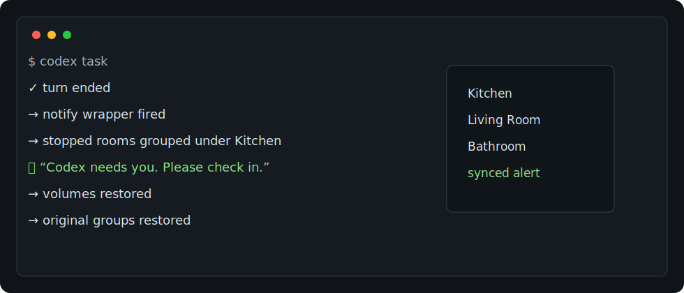

# Demo

Agent Sonos Chime turns local agent completion events into synced Sonos alerts.

Flow:

1. Codex or Claude Code reaches a point where it needs attention.
2. The hook runs the matching wrapper script.
3. Stopped Sonos rooms temporarily group for synced playback.
4. The voice alert plays.
5. Volumes and grouping are restored.

The demo image is illustrative. It does not include any private desktop,
terminal, or audio recording.
